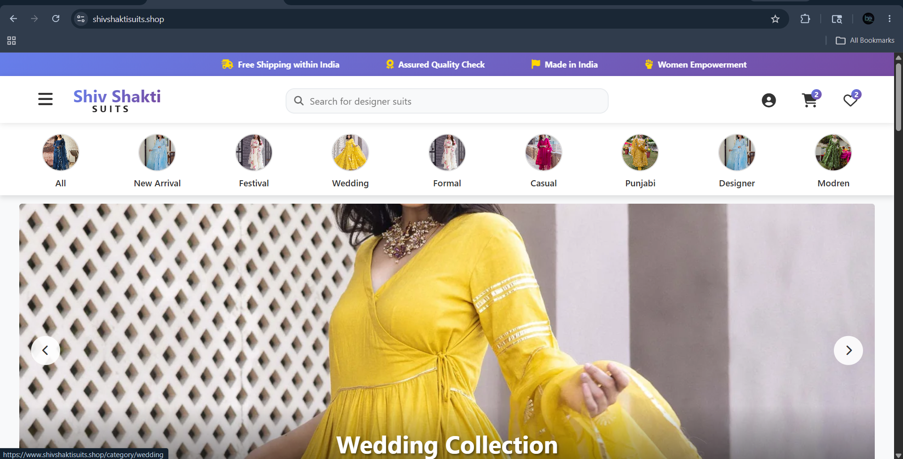
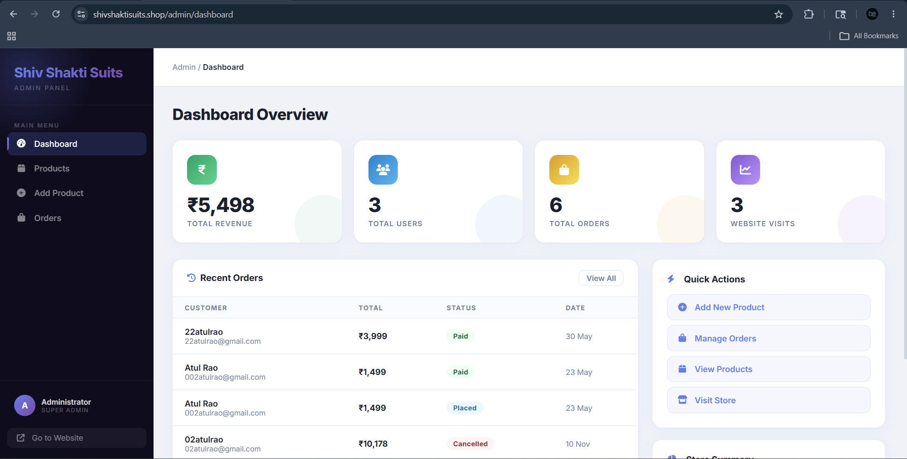
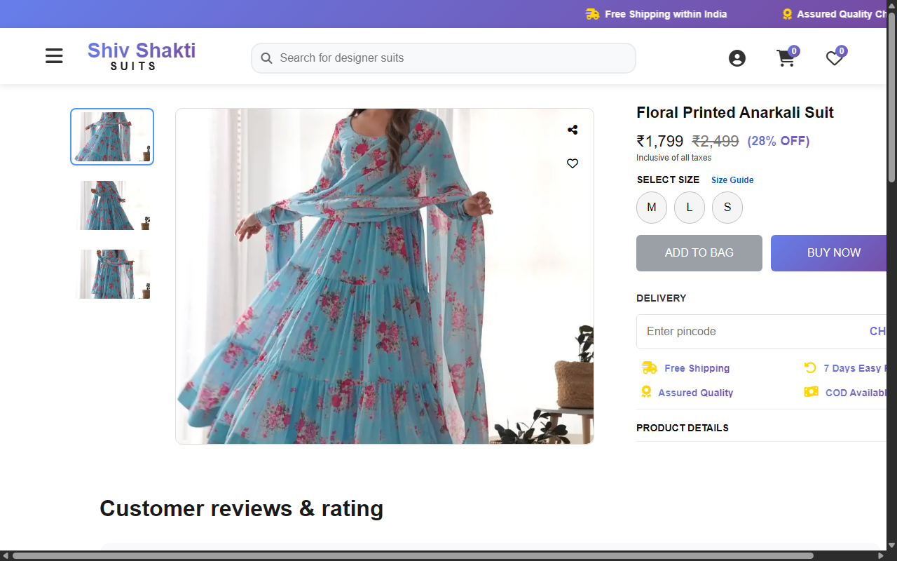
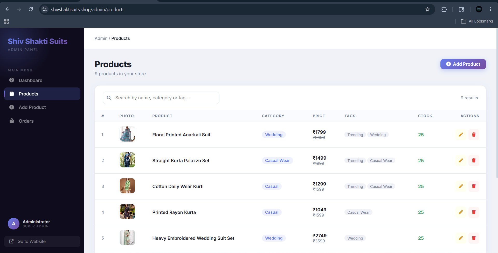
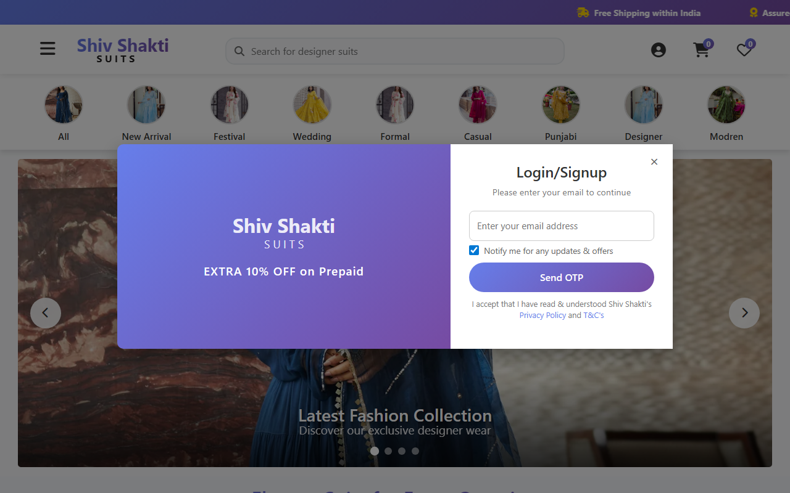
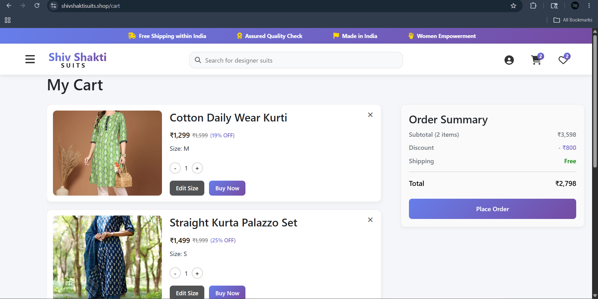
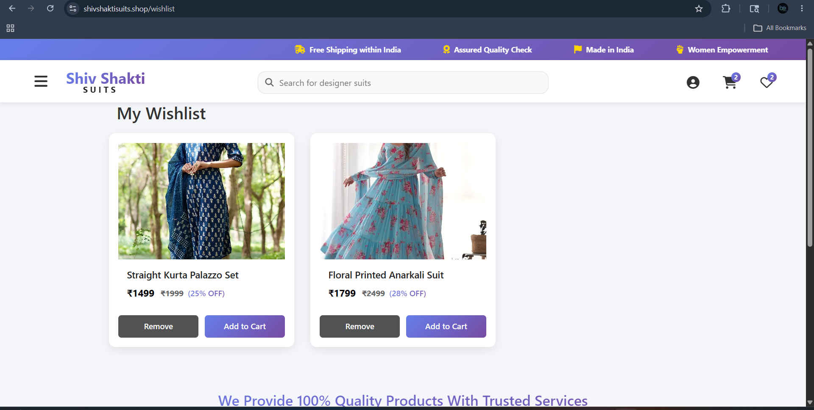
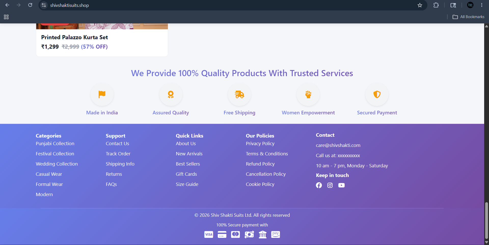

<div align="center">
  <h1 align="center">🛍️ Shiv Shakti Suits</h1>
  <p align="center">
    <strong>A Premium Hybrid Full-Stack E-Commerce Platform</strong>
    <br />
    Combining server-side rendered storefronts with a ultra-modern decoupled React.js administrative workspace.
    <br />
    <br />
    <a href="#-live-demo"><strong>View Demo »</strong></a>
    <br />
    <br />
    <a href="#-architecture">Architecture</a> · <a href="#-features">Features</a> · <a href="#-tech-stack">Tech Stack</a> · <a href="#-installation-guide">Setup</a>
  </p>

  <!-- Badges -->
  <p align="center">
    
    
    
    
    
    
  </p>
</div>

---

## 📝 Project Overview

**Shiv Shakti Suits** is a premium, production-ready e-commerce platform custom-tailored for ethnic fashion retail. 

The application utilizes a **high-performance hybrid architecture**:
1. **Storefront:** A server-side rendered (SSR) catalog built using **EJS (Embedded JavaScript)** for SEO optimization, rapid page delivery, and seamless customer checkout experiences.
2. **Admin Panel:** A state-of-the-art, fully decoupled single-page application (SPA) built using **React.js** and **Vite** for smooth, responsive, and app-like management of inventory, orders, and sales metrics.

---

### 💻 Technology Breakdown

| Component | Technology | Description |
| :--- | :--- | :--- |
| **Storefront** | HTML5, Vanilla CSS, JavaScript, EJS | SEO-friendly, fast-loading customer portal. |
| **Admin Panel** | **React.js 18**, Vite, React Router v6, CSS | Fully reactive administrative panel with dynamic data tables. |
| **Backend API** | Node.js, Express.js | Unified backend routing client static assets, view controllers, and JSON endpoints. |
| **Database** | MongoDB & Mongoose ODM | Documents database handling products, user sessions, and orders. |
| **Session & Auth** | `express-session`, `connect-mongo`, `bcryptjs` | MongoDB-backed persistent user sessions & password encryption. |
| **Payments** | Razorpay Node SDK | Complete checkout and payment signature verification flow. |
| **Services** |  Mailersend, Cloudinary | Automated e-mail systems & cloud image hosting for product photos. |

---

## ✨ Features

### 🛍️ Customer Storefront (EJS)
- **🛡️ Secure User Authentication:** Sign up/Log in functionality with encrypted passwords (`bcryptjs`) and secure persistent session management.
- **🛒 Dynamic Cart & Wishlist:** Real-time cart updates processing individual product variants, sizes, and quantities.
- **💳 Integrated Checkout Flow:** Secure real-time payment gateway orchestration via **Razorpay** with automated inventory reservation.
- **📍 Smart Address Management:** Save multiple user addresses (Home, Work, Other) and validate delivery pin codes.
- **⭐ Reviews & Ratings:** Intelligent best-seller tracking and average user rating aggregation.

### 🔐 Decoupled Admin Panel (React.js)
- **📊 Real-time Dashboard:** Animated stats cards tracking Total Revenue, Orders, Users, and Live Visits alongside recent activity feeds.
- **📦 Inventory Management:** Add, update, and edit products seamlessly. Features a powerful **two-column edit modal** supporting multi-image upload directly to Cloudinary.
- **⚙️ Dynamic Variant Builder:** Create product sizes and custom stock values on the fly.
- **🏷️ Order Operations Hub:** Track all store orders, search by customer, filter by checkout state, and update processing statuses (Placed, Processing, Shipped, etc.) with real-time UI state updates.
- **🚀 Advanced Caching (SWR-style):** Client-side SWR caching provides instantaneous (0ms) page loads, pulling from the global cache on page switches while silently checking for updates in the background.

---

## 📸 Project Showcase

To give you a visual tour of the platform's dual design systems, here is a side-by-side presentation of the customer storefront and the administrative control center:

<table width="100%">
  <tr>
    <td width="50%" align="center" valign="top">
      <h4>🛍️ Customer Storefront (EJS)</h4>
      
      <p><em>The landing experience showcasing dynamic banner carousels, categories, and bestseller feeds.</em></p>
    </td>
    <td width="50%" align="center" valign="top">
      <h4>🔐 Admin Dashboard (React.js)</h4>
      
      <p><em>Real-time metrics control panel displaying live traffic stats, revenue aggregation, and order feeds.</em></p>
    </td>
  </tr>
  <tr>
    <td width="50%" align="center" valign="top">
      <h4>👕 Dynamic Product Page (EJS)</h4>
      
      <p><em>Detailed storefront page displaying product description, size variant availability, and interactive ratings.</em></p>
    </td>
    <td width="50%" align="center" valign="top">
      <h4>📦 Inventory Manager (React SPA)</h4>
      
      <p><em>Modern React.js wizard to instantly add items, create dynamic sizes, and configure custom stock levels.</em></p>
    </td>
  </tr>
  <tr>
    <td width="50%" align="center" valign="top">
      <h4>🔐 User Access Modal (EJS)</h4>
      
      <p><em>Sleek user sign-in and registration dialog overlaying the storefront home screen.</em></p>
    </td>
    <td width="50%" align="center" valign="top">
      <h4>🛒 Shopping Cart Portal (EJS)</h4>
      
      <p><em>Real-time shopping cart tracking selected product variants, size parameters, and checkout details.</em></p>
    </td>
  </tr>
  <tr>
    <td width="50%" align="center" valign="top">
      <h4>❤️ Customer Wishlist Suite (EJS)</h4>
      
      <p><em>Personalized collection panel where customers curate and save their favorite suit designs.</em></p>
    </td>
    <td width="50%" align="center" valign="top">
      <h4>🦶 Elegant Site Footer (EJS)</h4>
      
      <p><em>Fully branded footer featuring fast navigation tabs, direct email triggers, and a newsletter system.</em></p>
    </td>
  </tr>
</table>

---

## 📁 Folder Structure

```text
📦 Shiv-Shakti-Fashion
 ┣ 📂 admin-panel/            # Modern React.js Admin Workspace (Vite + React Router)
 ┃ ┣ 📂 src/                  # React source files (components, pages, routing)
 ┃ ┃ ┣ 📂 components/         # Layout, Sidebar, Topbar, and reusable UI
 ┃ ┃ ┣ 📂 hooks/              # Custom caching and business logic hooks
 ┃ ┃ ┣ 📂 pages/              # Dashboard, Products, Orders, AddProduct
 ┃ ┃ ┣ 📜 App.jsx             # Router and Global Page structure
 ┃ ┃ ┗ 📜 main.jsx            # SPA Application entrypoint
 ┃ ┗ 📜 vite.config.js        # Vite configuration & dev proxy
 ┣ 📂 backend/                # Unified Node/Express Backend Server
 ┃ ┣ 📂 config/               # Database and third-party configuration files (Cloudinary)
 ┃ ┣ 📂 middleware/           # Auth, isAdmin guard, and traffic count middlewares
 ┃ ┣ 📂 models/               # Mongoose DB Schemas (User, Product, Order)
 ┃ ┣ 📂 routes/               # Express routing (home, product routes, admin routes)
 ┃ ┣ 📂 views/                # Customer-facing EJS templates (cart, productShow, index)
 ┃ ┗ 📜 server.js             # Main server entrypoint & static config
 ┣ 📂 public/                 # Built distribution folder (Served by Express)
 ┃ ┣ 📂 admin-panel/dist/     # Compiled production files for the React Admin Panel
 ┃ ┣ 📂 assets/               # Global brand assets/images
 ┃ ┣ 📂 css/                  # Storefront EJS styling files
 ┃ ┗ 📂 js/                   # Storefront EJS client-side JS functionality
 ┣ 📜 package.json            # Root project wrapper/runner
 ┗ 📜 README.md               # Project documentation
```

---

## 🛠️ Installation Guide

Follow these steps to set up both the backend server and the React admin panel locally.

### Prerequisites
- [Node.js](https://nodejs.org/en/) (v18.x or above)
- [MongoDB](https://www.mongodb.com/) (Local or Atlas cloud cluster)
- Git

### 1. Clone the repository
```bash
git clone https://github.com/AtulRao22/Shiv-Shakti-Suits.git
cd Shiv-Shakti-Suits
```

### 2. Set Up the Backend
```bash
cd backend
npm install
```

### 3. Set Up the Admin Panel (React)
```bash
cd ../admin-panel
npm install
```

### 4. Build and Compile the React SPA
Build the React production assets into the Express public directory:
```bash
npm run build
```

### 5. Start the Application
From the `backend/` directory, start the server in development mode:
```bash
cd ../backend
npm run dev
```

Open your browser and navigate to:
* **E-Commerce Storefront:** `http://localhost:8080/`
* **React Admin Panel:** `http://localhost:8080/admin-panel/`

---

## 🔐 Environment Variables

Create a `.env` file inside the `/backend` folder. You will need the following keys to run the application:

```env
# Server
PORT=8080
SESSION_SECRET=your_super_secret_session_key

# Database
MONGO_URL=mongodb+srv://<username>:<password>@cluster.mongodb.net/xyz-fashion

# Razorpay (Payments)
RAZORPAY_KEY_ID=your_razorpay_key
RAZORPAY_KEY_SECRET=your_razorpay_secret

# Cloudinary (Image Hosting)
CLOUDINARY_CLOUD_NAME=your_cloud_name
CLOUDINARY_API_KEY=your_api_key
CLOUDINARY_API_SECRET=your_api_secret

# Optional Services (Emails)
RESEND_API_KEY=your_resend_api_key
BREVO_API_KEY=your_brevo_api_key
```

---

## 📈 Challenges & Performance Tuning

- **Advanced Response Parallelization:** Reconstructed administrative JSON endpoints using `Promise.all` to fetch statistics, count items, and pull transaction streams concurrently—saving up to 60% of database transaction wait times.
---

## 🙋‍♂️ Author

**Atul Rao**  
*MERN Stack Developer*  
📍 Jaipur, Rajasthan, India 

- **GitHub:** [@AtulRao22](https://github.com/AtulRao22) 
- **LinkedIn:** [atul-rao-44b2212b8](https://www.linkedin.com/in/atul-rao-44b2212b8/) 
- **Email:** 02atulrao@gmail.com

---
<p align="center">Made with ❤️ by Atul Rao</p>
